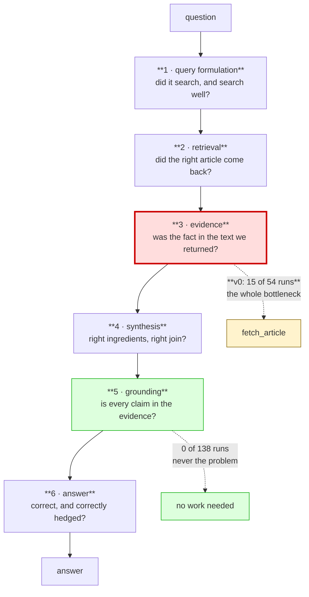

# Design rationale

A Claude agent that answers questions using Wikipedia, and an eval suite that
measures it. Everything claimed here is backed by committed artifacts —
traces, per-run verdicts, hand labels and four sweeps live in `results/`.
This document is the reasoning that the artifacts don't contain.

---

## 1. Guiding principles

Four, chosen up front and visible in every decision that follows.

**Simple surfaces.** One prompt, one tool to start. Every capability added
later had to be argued for by an eval result, not by anticipation. The system
ended with two tools and a ~150-word prompt.

**Deterministic wherever possible.** An LLM judge is a last resort, used only
where a deterministic signal was *built, measured, and observed to fail*. This
is a safeguards instinct: exact signals can be wrong, but they are wrong the
same way every time, and you can test them.

**Let the results lead.** No taxonomy, no metric set and no failure funnel was
finalised before running the system and reading what it did. This is also why
the eval set includes questions nobody on the project chose.

**Guard against silent corruption, not just crashes.** A run that fails costs
an hour; a run that is quietly wrong costs a phase of false conclusions. This
principle earned its place repeatedly — see §7.

---

## 2. Approach: sweep first, taxonomy second

The first real activity was not designing metrics. It was running 31 questions
once each and **reading every trace by hand**.

Defining the taxonomy first would have produced an eval that could only confirm
what we already believed. Two concrete things say it mattered:

- **The funnel weights inverted.** We expected grounding (fabrication) to
  dominate — it is the famous failure of retrieval-augmented systems. It came
  in at **zero across 138 runs**. The real bottleneck was retrieval *depth*,
  which we had barely scoped.
- **Two of the six failure sub-modes were not on anyone's list**, including the
  one that mattered most.

Repeats came *after* reading. Running a question three times before reading it
once buys nothing and costs 3×.

---

## 3. Prompt engineering

**Three surfaces, not one.** The system prompt, the tool descriptions, *and*
the rendered tool output are all prompt engineering — the last one is what the
model actually reads most of. All three are versioned **together**, because a
tool-description edit otherwise silently invalidates a previous sweep while the
trace still claims the runs are comparable.

**Frozen by digest.** Each version's text is hashed and asserted in a test. This
is not ceremony: mid-project it caught a live edit to a prompt that had already
been scored against, and every trace now records the digest of what actually
ran, so "which wording produced these numbers?" is answerable from the results
rather than from file timestamps.

**Short on purpose.** ~150 words. A long prompt makes a delta unattributable
and leaves no room to hill-climb where evals point.

**Every line traceable to an observed failure.** Examples: *"Name the articles
you used, by their exact titles"* exists because the model paraphrased titles
and made citation-matching unreadable. *"Search for one subject at a time"*
exists because of an observed multi-hop failure.

---

## 4. Eval design

### Three question sets, three jobs

| Set | Size | Job |
|---|---|---|
| **Curated** | 18 | Test what we decided matters; regression anchors |
| **Explore** (random) | 20 | Find what we *didn't think of* |
| **Holdout** (random, disjoint) | 10 | Ground the result |

The random sets are drawn from Natural Questions — real Google queries, frozen
by seed, **nothing filtered**. Dropping the awkward ones would put our own
taxonomy straight back in.

**The random draw earned its keep decisively.** Five of six failures in the
random set shared one cause — the right article retrieved, the answer in the
article body the tool never read. **The curated set surfaced zero instances.**
Real users ask about cast members, filming locations and counts; that material
lives below the intro, and we would not have written those questions.

**The holdout exists because the curated set becomes training data.** Once
failures are promoted into it and fixed against, it can no longer tell you
whether you generalised. Discipline is enforced by the harness, not by
intent: `--holdout` suppresses the review worksheet and label file entirely,
and the cross-arm report emits holdout aggregates only — no case ids, no
answers. A test asserts the report never names a holdout case.

### What is measured, and by what

**Deterministic (preferred).** Correctness against hand-authored accepted
phrasings; retrieval quality against whether the retrieved text carried the
evidence, matched per tool call and accumulated across calls so a multi-hop
question isn't blamed on retrieval. Crossing the two gives the funnel stage
exactly:

| | evidence found | not found |
|---|---|---|
| **answer right** | grounded | answered from memory |
| **answer wrong** | had it, didn't use it | never had it |

Plus corroboration (distinct articles cited), multi-fact coverage (see the
caveat below), tool discipline, turns, tokens, latency — and **pass^k**,
cases correct on *every* repeat, bucketed solid / flaky / systematic /
incomplete. A per-run rate hides the shape: 50% could be one case that always
works beside one that never does. It is **strict about unscored runs** — a
repeat the judge would not score is not a demonstrated pass, so it blocks a
`solid` claim rather than shrinking the denominator.

**Judged, where determinism was measured to fail.** Two dimensions survived
from five. *Ambiguity* is judged because the obvious deterministic proxy —
disambiguation-page retrieval — was built and misfired in **both** directions.
*Correctness* is judge-primary with the string matcher retained as a guardrail.
The judge is Sonnet 5 judging Haiku 4.5 (self-preference bias is documented),
rubric frozen and digest-tested, calibrated at **51/54** against hand labels
with **zero cases where it said `correct` and a human said `incorrect`**.

**Why both correctness signals are kept** — they fail in opposite directions,
and we have one instance of each:

- The matcher certified two failing runs as passes; an accepted phrasing
  (`login`) matched unrelated text. The judge flagged both.
- On another case the judge returned `incorrect` for an answer that was right,
  with a rationale that contradicted itself. The matcher had it right, three
  sweeps running.

Neither dominates. Disagreements are surfaced and adjudicated by hand.

### The failure funnel, and why it drove every fix

Six stages, ordered the way a run flows. **Failure propagates downstream:** a
stage-2 miss guarantees every stage below it fails too, so the same headline
score can mean completely different things and demands completely different
fixes. Attributing each run to its earliest failing stage is what made the fix
obvious rather than a guess.

The stage attribution is **computed, not hand-labelled** — it falls out of
crossing two exact signals (`answer_match` × `evidence_match`) plus `searched`,
so it comes free with every sweep. Iteration 0 needed a human reading 31 traces
to produce the same picture.

**Runs per stage, all three versions:**

| Stage | v0 | v1 | v2 | | v0 | v1 | v2 |
|---|---|---|---|---|---|---|---|
| | *curated (54)* | | | | *holdout (30)* | | |
| 1 · query — never searched | 0 | 0 | 0 | | 0 | 0 | 0 |
| 2 · retrieval — article never surfaced | 0 | 1 | 0 | | 2 | 0 | 0 |
| **3 · evidence — fact not in returned text** | **15** | **5** | **4** | | **3** | **0** | **0** |
| 4 · synthesis — had it, joined it wrong | 0 | 0 | 1 | | 0 | 2 | 2 |
| 5 · grounding — claimed what wasn't there | **0** | **0** | **0** | | **0** | **0** | **0** |
| correct | 37 | 47 | 49 | | 21 | 25 | 26 |
| not scorable (abstention cases) | 2 | 0 | 0 | | 4 | 3 | 2 |
| **accuracy** (all attempted runs) | **69%** | **87%** | **91%** | | **70%** | **83%** | **87%** |

Three things fall straight out of this table, and none are visible in an
accuracy number:

- **One stage held everything.** Stage 3 was 15 of 54 curated runs at v0 and
  every other stage was near zero. That is what made `fetch_article` the
  obvious intervention rather than one option among several — and why prompt
  tuning, better query wording or a bigger `top_k` would all have been wasted
  effort.
- **The stage we expected to dominate never appeared.** Grounding is zero in
  every version, in both arms, across 138 runs. Effort budgeted for
  hallucination went to retrieval depth instead.
- **The fix moved the stage it targeted and nothing else.** Stage 3 went
  15 → 5 → 4 curated and 3 → 0 → 0 held out, while stages 1, 2 and 5 stayed
  flat. A change that improves a score by moving several stages at once is
  usually a measurement artifact; this one didn't.

**Upstream matters more than downstream** — and it cuts both ways. It is why
stage 3 was worth fixing before anything below it, and it is why the two
remaining stage-3 failures (a fact past the 8,000-char cap) are worth more than
the stage-4 ones: nothing downstream can recover from evidence that never
arrived.

> **Metric contract.** Correctness counts confirmed successes over **every
> attempted run**: unclear judge verdicts, harness errors, wrong answers and
> declines on answerable questions are all non-successes. pass^3 keeps
> unresolved questions in the denominator. Evidence is reported over its
> eligible subset, with that denominator shown. Earlier drafts excluded
> unresolved runs, which flattered the V0 holdout by 11 points.

### The variance floor is measured

Two identical sweeps agree on **54/54** deterministic verdicts and differ on
2 judged runs. Variance is *concentrated*: zero flips across 39 runs on cases
with a reachable answer, 4 of 12 on cases where the answer doesn't exist. So a
change targeting retrieval can be measured at 3 repeats; a change targeting
abstention cannot. **An improvement below ~3 runs is not distinguishable from
noise on this set** — stated so results can be called unresolved rather than
overclaimed.

---

## 5. Versions and results

| Version | What changed | Curated | Holdout | pass^3 |
|---|---|---|---|---|
| *pre-baseline* | first draft; never scored | — | — | — |
| **v0** | search only, intros, top-3 | 69% | 70% | 12/18 |
| **v1** | **+ `fetch_article`** + 1 prompt line | **87%** | **83%** | **15/18** |
| v1 repeat | identical, to measure variance | 87% | 80% | 15/18 |
| **v2** | generalised escalation rule | **91%** | **87%** | 15/18 |

**Pre-baseline → v0** was defect repair, not tuning. The first draft hardcoded
"three articles" while `top_k` is a knob, asked for citations without saying
how, and never explained the truncation marker. It was never scored, so it was
never a baseline — it's archived rather than kept as a version.

**v0 → v1: the one intervention that mattered.** Adding `fetch_article` and a
single prompt line moved correctness **+18 points curated and +13 held out**,
with zero regressions among the 13 cases that already passed and stage-3
body-fact failures down 12 → 5. The tool is used selectively — a third of runs,
only where the intro genuinely lacked the answer, zero failed fetches, zero
fetches without a preceding search — and costs exactly one extra turn when
used. Cost: +63% input tokens, latency unchanged (the fetch *replaces* search
rounds).

**v1 → v2: a proven mechanism of unsized magnitude.** v1's rule said open *the*
article when its opening section lacked the answer, and the traces showed the
agent obeying it narrowly — it fetched the article whose title matched the
topic and never the article about the person who did the thing. `Leonard
Kleinrock` was a top-3 result in all six v1 runs of one case and fetched
**zero** times. v2 hands the choice back to the model, and it fetched Kleinrock
in 2 of 3 runs; both flipped to correct, and that article is the *only*
reachable path to the answer.

But **+2 runs against a 3-run noise bar is not a result**, and it is recorded
as unresolved rather than claimed. The real v2 win is efficiency: the worst case
went 9/9/10 turns → 7/6/8, **40% cheaper and 28% faster**, and v1's single
runaway error disappeared.

**That is the expected shape at ~90%.** With most headroom gone, further prompt
changes mostly buy efficiency, and pushing correctness higher on *these*
questions risks fitting the prompt to them. The right next move is harder
questions, not more prompt.

**The holdout tracked the curated set throughout** — within 3 points at v0
(71/81), v1 (89/93) and v2 (91/93), *including through a +18-point
intervention*. Overfitting would show as that gap widening exactly when
something was fixed. It didn't.

### Every dimension, all three versions

Reported in full rather than selectively, so improvements and degradations are
equally visible. **Noise bar: ~3 runs (~6%) on the curated arm** — smaller
movements are not results.

| | v0 cur | v1 cur | v2 cur | | v0 hold | v1 hold | v2 hold |
|---|---|---|---|---|---|---|---|
| **Quality** | | | | | | | |
| Correct (all attempted runs) | 69% | **87%** | **91%** | | 70% | **83%** | **87%** |
| Correct (contains, guardrail) | 62% | 89% | 91% | | 77% | 90% | 90% |
| pass^3 | 12/18 | **15/18** | 15/18 | | 7/10 | **8/10** | 8/10 |
| Multi-fact coverage *(2 cases, 6 runs)* | 89% | 100% | 100% | | 100% | 100% | 100% |
| **Retrieval** | | | | | | | |
| Evidence retrieved | 64% | **88%** | 90% | | 80% | **97%** | **100%** |
| Searched at all | 94% | 94% | 94% | | 100% | 100% | 100% |
| Searches / run | 1.5 | 1.4 | 1.4 | | 1.2 | 1.4 | 1.3 |
| Runs that opened an article | 0% | 32% | 37% | | 0% | 23% | 27% |
| Fetches / run | 0 | 0.36 | 0.43 | | 0 | 0.27 | 0.37 |
| Failed fetches | — | **0** | **0** | | — | **0** | **0** |
| **Cost** | | | | | | | |
| Turns (mean / max) | 2.4 / 5 | 2.6 / 10 | 2.7 / **8** | | 2.2 / 4 | 2.7 / 10 | 2.7 / **8** |
| Output tokens | 223 | 234 | 251 | | 194 | 240 | 248 |
| Answer length (chars) | 496 | 447 | 498 | | 399 | 386 | 411 |
| Latency median (s) | 3.4 | 3.1 | 3.2 | | 3.1 | 2.9 | **2.4** |
| **Instrument health** | | | | | | | |
| Articles cited / answer | 1.5 | 1.3 | 1.3 | | 1.2 | 1.3 | 1.1 |
| Judge/matcher disagreements | 0/31 | 0/40 | 1/41 | | 0/23 | 1/25 | 0/28 |
| Judge unclear | 2 | 0 | 0 | | 4 | 3 | 2 |
| Errors | 0 | 1 | **0** | | 0 | 0 | 0 |

**What improved.** Quality and retrieval move together and clear the bar at
v0→v1: correctness +18 curated / +13 held out, evidence retrieved +24 / +17,
and held-out evidence retrieval reaches **100%** at v2 —
every question's answer-bearing text was returned. Both correctness signals
move in lockstep, which is worth more than either alone: they are computed
independently and disagree on 1 of 41 runs.

**A metric that did not earn its place.** I built a completeness signal — the
fraction of a case's required facts present in the answer — and it turned out
to be near-degenerate on this set. Only 2 of 18 curated cases have more than
one required fact, so for 39 of 45 scored runs the fraction is 0.0 or 1.0 and
identical to `answer_match`, and no run scored partial in v1 or v2. Averaged
over everything it looked like a fourth dimension while restating correctness.
It is now reported only over the cases that exercise it, with the sample size
inline, and it does work there: `switzerland-borders` named 4 of 5 bordering
countries at v0 and all 5 from v1. Making it meaningful needs more multi-fact
cases, which is a case-set problem rather than a metric problem.

**What degraded, honestly.** Output tokens rose 223 → 251 (+13%) and answer
length returned to the v0 level after dipping at v1 — the fetch tool makes
answers slightly wordier. **Articles cited per answer fell 1.5 → 1.3**, and on
the held-out arm 1.2 → 1.1: the agent leans on one deeply-read article where it
used to name several, which is a small loss of corroboration and the one
genuine regression here. Fetch usage climbed 32% → 37% for +2 correct runs, so
the marginal fetch is buying less than the first ones did.

**What stayed flat, and should have.** Search behaviour is unchanged across all
three versions (94% searched, ~1.4 searches/run) — the intervention targeted
retrieval *depth*, and it did not disturb retrieval *breadth*. Zero failed
fetches and zero fetches without a preceding search, in every version, which is
the check that the new tool never became a guessing mechanism.

---

## 6. Where it fails

- **The 8,000-char fetch cap is now the binding constraint.** 19 of 22 fetches
  came back truncated. One case's answer sits at offset ~15,650 of a
  44,579-char article — in the prose, past what we read.
- **Absence claimed from truncated text.** The agent asserts a fact is missing
  *from the article* having read part of it. Three attempts to fix this by
  prompt have produced **zero** acknowledgements of truncation across 162 runs.
  It needs a mechanism, not more words.
- **Infobox and table data is unreachable** — plaintext extracts omit both.
- **Ambiguity handling is inconsistent**, and often decided upstream by the
  agent's own query wording before it notices an ambiguity exists.

**What does *not* fail: grounding.** Zero fabricated claims and zero fabricated
citations across 138 runs. Every figure spot-checked against the rendered tool
output was present in it. The system's honest failure mode is declining to
answer, not inventing one.

---

## 7. When the instrument was wrong

Worth its own section, because it happened more often than agent failures did.

- **Three false passes** from hand-authored accepted phrasings matching
  unrelated text.
- **A circular test.** It "verified" a fact was infobox-only by asserting it was
  absent from text the fetcher had already truncated — it would have passed
  wherever the fact lived.
- **Two wrong case notes**, each a plausible cause written down and never
  checked against what the tool returned.
- **A stale-reference bug that fabricated a +3 improvement** between two
  identical sweeps: a case's expected answer was rewritten mid-project and old
  judge verdicts were carried over, so the judge saw a different reference while
  the agent's answers were byte-identical.
- **Three `None`-read-as-`False` bugs**, each turning an unmeasured signal into
  a failed one.

**None were found by the test suite.** All were found by reading traces or
generated reports. The suite's real job turned out to be *preventing regression
of things already understood* — it discovered nothing.

Every one is now covered by a test, and `evals/regrade.py` re-scores a finished
sweep from saved traces with no API calls, so fixing a grader costs a re-grade
rather than a re-run.

---

## 8. Lessons

**There is no replacement for reading traces.** Every real finding in this
project came from reading them. Aggregate metrics told us *that* something was
wrong; only traces told us *what*, and several times told us the metric itself
was broken.

**The best review is hybrid — a strong model and a human, disagreeing.** Both
were used here and they failed differently. The model found things I missed: a
query seeded from a hallucinated character name, the circular test, the stale
reference. I found things it got wrong: an over-claimed conclusion about one
case, and three ambiguity labels *it* was right about and I wasn't. The
disagreements were where the value was — which is the same argument as keeping
both correctness signals, one level up.

---

## 9. With more time

Ordered by evidence behind them, not appeal.

1. **Fix the cap, not the prompt.** Paging (`from_offset`), section-level fetch,
   or a larger cap. Direct evidence: 19 of 22 fetches truncated.
2. **Token efficiency.** 13% of evidence characters are *re-delivered* snippets
   — one article's intro was re-shown up to six times in a single run.
3. **A summarising pass over long articles.** The only candidate that addresses
   extraction failures where the fact was already on screen — but it puts a
   second model between the agent and the evidence, which risks the one
   dimension currently at zero fabrications. Measure the cap fix first.
4. **More questions from the wild, and harder ones.** At ~90% the current set is
   near its ceiling. New random draws cost 20 runs and have already proven the
   highest-yield source of unknown failure modes.
5. **Deliberate adversarial evals** — instructions embedded in retrieved text,
   over-refusal on encyclopedic-but-sensitive topics. Scoped out here to keep
   the pass on core functionality.
6. **A structured trace-analysis agent, itself evaluated.** The analysis loop is
   now the bottleneck, not the agent: it is the only fully manual step, and it
   is where every finding came from. Making it repeatable — and measuring *it*
   against human labels, exactly as the judge was — is the highest-leverage
   remaining piece of infrastructure.

